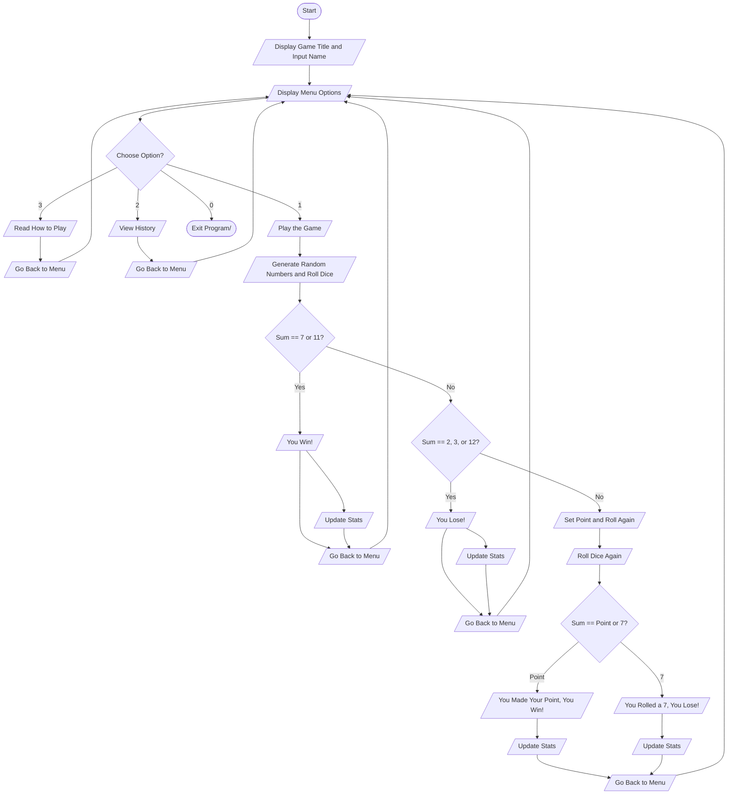

```mermaid

flowchart TD
    start([Start]) --> title[/Display Game Title and Input Name/]
    title --> menuOptions[/Display Menu Options/]
    menuOptions --> menuDecision{Choose Option?}
    
    menuDecision -->|1| playGame[/Play the Game/]
    menuDecision -->|2| viewHistory[/View History/]
    menuDecision -->|3| howToPlay[/Read How to Play/]
    menuDecision -->|0| exit([Exit Program/])
    
    howToPlay --> backToMenu1[/Go Back to Menu/]
    backToMenu1 --> menuOptions
    
    viewHistory --> backToMenu2[/Go Back to Menu/]
    backToMenu2 --> menuOptions
    
    playGame --> rollDice[/Generate Random Numbers and Roll Dice/]
    rollDice --> checkSum1{Sum == 7 or 11?}
    checkSum1 -->|Yes| win1[/You Win!/]
    win1 --> updateStats1[/Update Stats/]
    win1 --> backToMenu3[/Go Back to Menu/]
    updateStats1 --> backToMenu3
    backToMenu3 --> menuOptions
    
    checkSum1 -->|No| checkSum2{Sum == 2, 3, or 12?}
    checkSum2 -->|Yes| lose1[/You Lose!/]
    lose1 --> updateStats2[/Update Stats/]
    lose1 --> backToMenu4[/Go Back to Menu/]
    updateStats2 --> backToMenu4
    backToMenu4 --> menuOptions
    
    checkSum2 -->|No| setPoint[/Set Point and Roll Again/]
    setPoint --> rollAgain[/Roll Dice Again/]
    rollAgain --> checkPoint{Sum == Point or 7?}
    checkPoint -->|Point| win2[/You Made Your Point, You Win!/]
    checkPoint -->|7| lose2[/You Rolled a 7, You Lose!/]
    
    win2 --> updateStats3[/Update Stats/]
    lose2 --> updateStats4[/Update Stats/]
    
    updateStats3 --> backToMenu5[/Go Back to Menu/]
    updateStats4 --> backToMenu5
    backToMenu5 --> menuOptions


```

