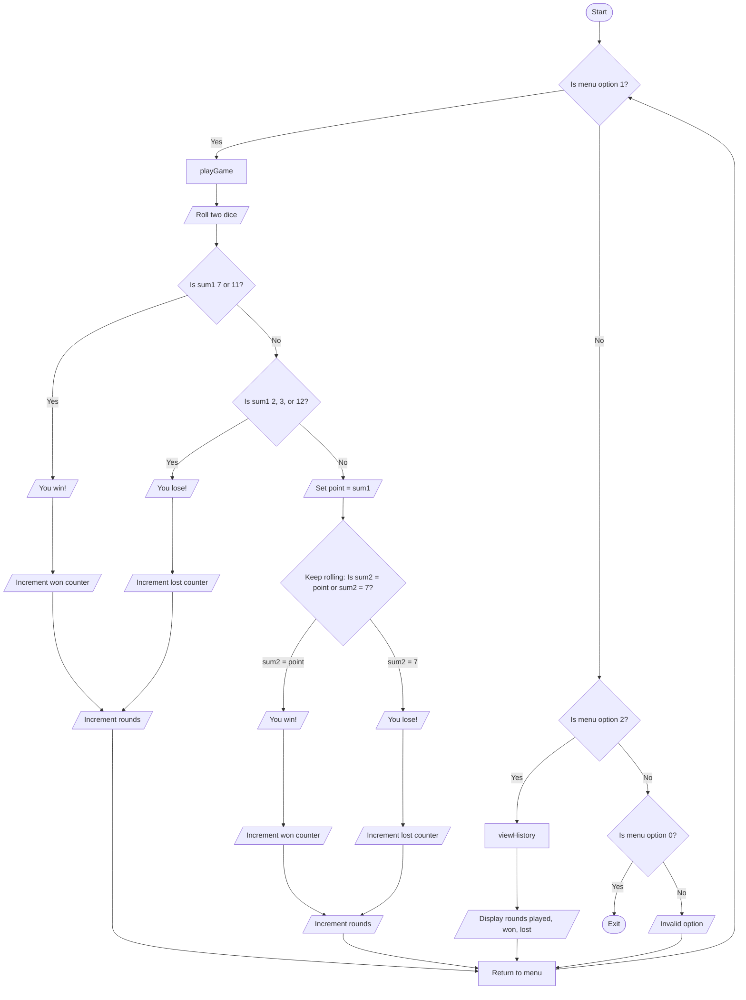

```mermaid

flowchart TD
    start([Start]) --> mainMenu{Is menu option 1?}
    mainMenu -->|Yes| playGame
    mainMenu -->|No| checkOption2{Is menu option 2?}
    checkOption2 -->|Yes| viewHistory
    checkOption2 -->|No| checkExit{Is menu option 0?}
    checkExit -->|Yes| exit([Exit])
    checkExit -->|No| invalidOption[/Invalid option/]

    viewHistory --> displayHistory[/Display rounds played, won, lost/]
    displayHistory --> returnToMenu[Return to menu]
    returnToMenu --> mainMenu

    playGame --> rollDice[/Roll two dice/]
    rollDice --> checkSum1{Is sum1 7 or 11?}
    checkSum1 -->|Yes| win1[/You win!/]
    checkSum1 -->|No| checkLose1{Is sum1 2, 3, or 12?}
    checkLose1 -->|Yes| lose1[/You lose!/]
    checkLose1 -->|No| setPoint[/Set point = sum1/]

    setPoint --> rollUntil{Keep rolling: Is sum2 = point or sum2 = 7?}
    rollUntil -->|sum2 = point| win2[/You win!/]
    rollUntil -->|sum2 = 7| lose2[/You lose!/]

    win1 --> incrementWon1[/Increment won counter/]
    lose1 --> incrementLost1[/Increment lost counter/]
    win2 --> incrementWon2[/Increment won counter/]
    lose2 --> incrementLost2[/Increment lost counter/]

    incrementWon1 --> incrementRounds1[/Increment rounds/]
    incrementLost1 --> incrementRounds1
    incrementWon2 --> incrementRounds2[/Increment rounds/]
    incrementLost2 --> incrementRounds2

    incrementRounds1 --> returnToMenu
    incrementRounds2 --> returnToMenu
    invalidOption --> returnToMenu


```

