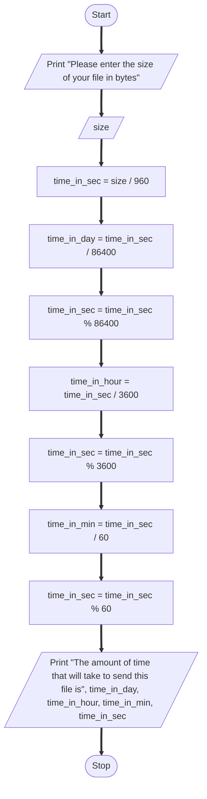

### Problem
A serial transmission line can transmit 960 characters a second. Write a program that will calculate how long
it will take to send a file, given the file size. Test your program on a 400MB (419,430,400 byte) file which may
take days.

### Problem analysis
**Input** - File size  
**Output** - Time it takes to transfer the a file with the given file size  
**Process** -  
Accepting input file size  
Calculating time it takes to send file in seconds as file size / 960  
calculating time it takes to send file in days, hours and minutes  

### Pseduocode
1. Start  
2. Accept file size  
3. Calculate time it takes to send file in seconds as "file size / 960"  
4. Calculate time it takes to send file in days as "time it takes to send file in seconds / 86400"  
5. Calculate time it takes to send file in seconds as "time it takes to send file in seconds % 86400"  
6. Calculate time it takes to send file in hours as "time it takes to send file in seconds / 3600"  
7. Calculate time it takes to send file in seconds as "time it takes to send file in seconds % 3600"  
8. Calculate time it takes to send file in minutes as "time it takes to send file in seconds / 60"  
9. Calculate time it takes to send file in seconds as "time it takes to send file in seconds % 60"  
10. Print "The amount of time that will take to send this file is", time it takes to send file in days, time it takes to send file in hours, time it takes to send file in minutes, time it takes to send file in seconds  

### Flowchart

