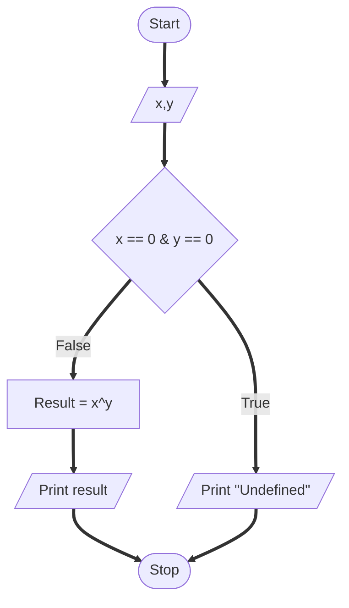

### Problem
Write a program that find the result of the expression xy where the value of X and Y are entered by the user.

### Problem analysis
**Input** - x, y  
**Output** - result  
**Process** -  
Accepting input x,y  
Calculating result as xy  

### Pseduocode
1. Start
2. Accept x,y
3. Check x = 0 & y = 0
    <ol>
      <li>If True, go to step 4</li>
      <li>If False, go to step 5</li>
    </ol>
4. Print "Invalid"
5. Calculate result = xy
6. Print result
7. Stop

### Flowchart

