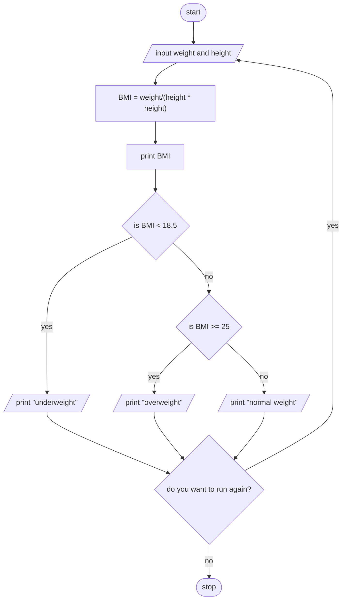

> **Problem Description**: Make a program that calculates the Body Mass Index (BMI) of a person and determine weather the person is
> in normal weight, under weight or over weight. BMI is calculated as (BMI = w/h*h). Make the program to work for multiple person 
> before terminated.

**Problem Analysis**:  
*Input*: weight in kilograms (float), height in metres (float)  
*Output*: Body Mass Index/BMI (float)  
*Process*:
- input weight and height
- calculate BMI as weight/(height * height)
- print BMI
- check if BMI is under 18.5, between 18.5 and 25 (including 18.5), or above 25 (including 25)
  in the first case print underweight, in the second case print normal weight, or in the third case print overweight
- check if the user wants the program to run again
  if they do run the program again, if they don't terminate the program

**Flowchart**:

**Pseudocode**:  
1. START
2. REPEAT
3. READ weight and height
4. CALCULATE BMI as weight/(height * height)
5. PRINT BMI
6. IF BMI < 18.5 THEN
7. PRINT underweight
8. ELSE IF BMI >= 25 THEN
9. PRINT overweight
10. ELSE
11. PRINT normal weight
12. ENDIF
13. READ if the user wants the program to run again
14. UNTIL the user does not want the program to run again
15. STOP
