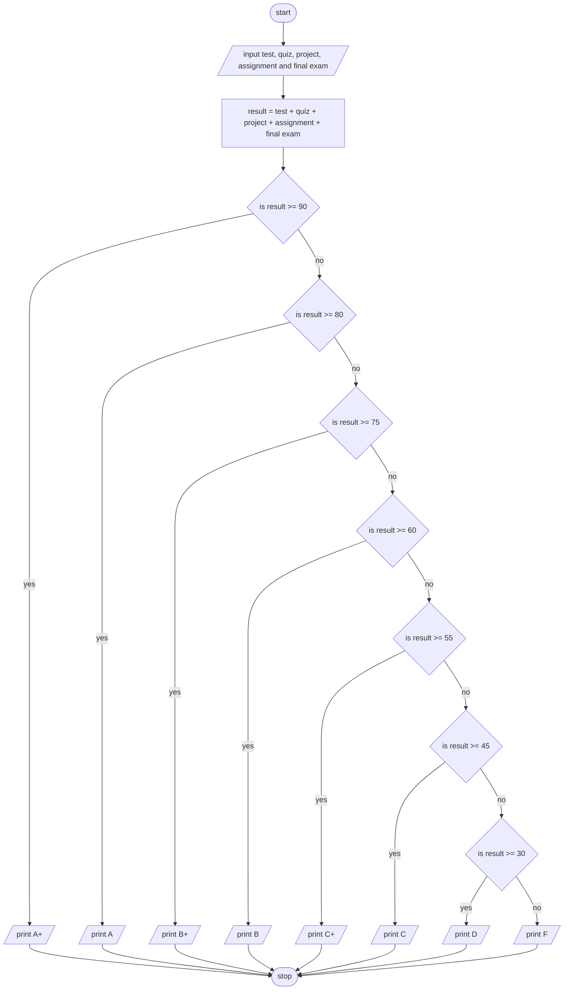

> **Problem Description**: Write a program that read the various assessments, compute the total mark and print the
> corresponding letter-grade based on the following scales.  
> *Assessments*: Test 15%, Quiz 5%, Project 20%, Assignment 10%, Final exam 50%  
> *Grade-letter scale*: A+ >=90, A >=80, B+ >=75, B >=60, C+ >= 55, C >=45, D >=30, F <30

**Problem Analysis**:  
*Input*: test (float), quiz (float), project (float), assignment (float), final_exam (float)  
*Output*: grade (string)  
*Process*:  
- input test, quiz, project, assignment and final exam
- calculate result as test + quiz + project + assignment + final exam
- if result >= 90 print A+
- else if result >= 80 print A
- else if result >= 75 print B+
- else if result >= 60 print B
- else if result >= 55 print C+
- else if result >= 45 print C
- else if result >= 30 print D
- else print F

**Flowchart**:  

