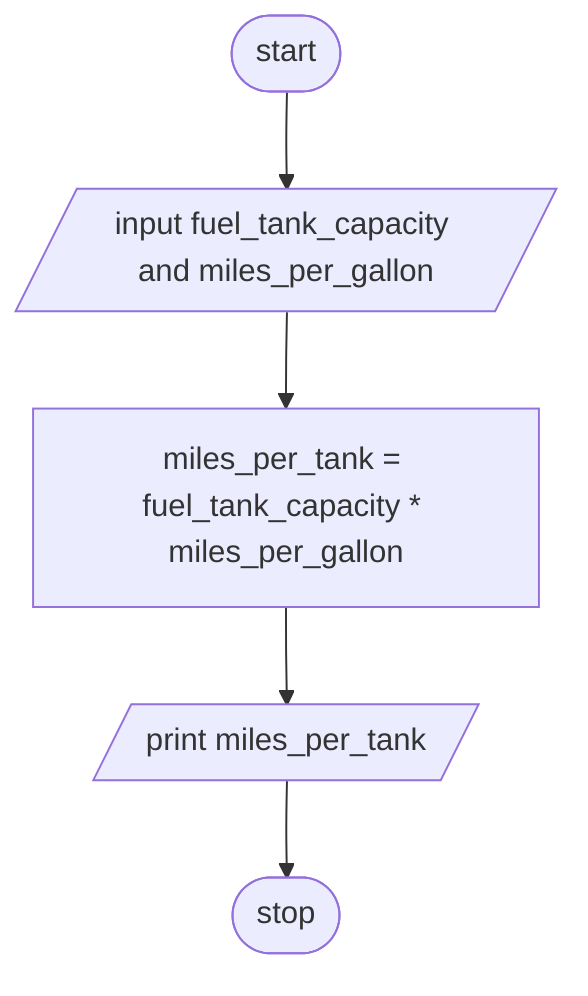

> **Problem Description**: Write a program that prompts the capacity in gallons of an automobile fuel tank and the miles per 
> gallons the automobiles can be driven. The program outputs the number miles the automobile cam be driven without refueling.

**Problem Analysis**:  
*Input*: fuel_tank_capacity in gallons (float), miles_per_gallon (float)  
*Output*: miles_per_tank (float)  
*Process*:
- input fuel_tank_capacity and miles_per_gallon
- calculate miles_per_tank as fuel_tank_capacity * miles_per_gallon
- print miles_per_tank

**Flowchart**:

**Pseudocode**:
1. START
2. READ fuel_tank_capacity and miles_per_gallon
3. CALCULATE miles_per_tank as fuel_tank_capacity * miles_per_gallon
4. PRINT miles_per_tank
5. STOP
