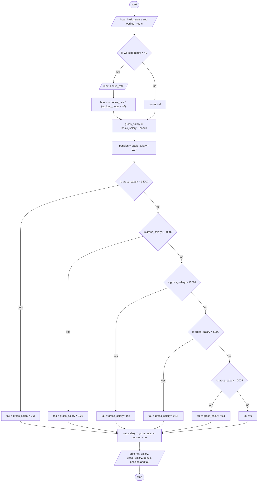

> **Problem Description**: Develop a program that find the Net-Pay of an employee after deduction of pension (7%) and tax based on tax rate provided. The
> program should read the basic salary, worked hours, and bonus rate. If the employee worked hours exceed 40 hrs., the program prompts the user to enter an
> over-time bonus rate/hour.
> 
> *Tax Rate Range*:  
> Up to 200Br:    0%  
> 200Br-600Br:    10%  
> 600Br-1200Br:   15%  
> 1200Br-2000Br:  20%  
> 2000Br-3500Br:  25%  
> 3500Br & above: 30%
>
> gross salary = basic salary + bonus  
> bonus = extra work-hours * bonus rate  
> pension = basic salary * 0.07  
> tax = gross salary * tax rate  
> net salary = gross salary - pension - tax

**Problem Analysis**:  
*Input*: basic_salary (float), worked_hours (float), bonus_rate (float)  
*Output*: net_salary (float), gross_salary (float), bonus(float), pension (flaot), tax (float)  
*Process*:
- input basic_salary and worked_hours
- if worked_hours > 40, input bonus_rate and calculate bonus as bonus_rate * (worked_hours - 40)
- else if worked_hours <= 40 set bonus to 0
- calculate gross_salary as basic_salary + bonus
- calculate pension as basic_salary * 0.07
- if gross_salary > 3500, calculate tax as gross_salary * 0.3
- else if gross_salary > 2000, calculate tax as gross_salary * 0.25
- else if gross_salary > 1200, calculate tax as gross_salary * 0.2
- else if gross_salary > 600, calculate tax as gross_salary * 0.15
- else if gross_salary > 200, calculate tax as gross_salary * 0.1
- else if gross_salary <= 200, set tax to 0
- calculate net_salary as gross_salary - pension - tax
- print net_salary, gross_salary, bonus, pension and tax

**Flowchart**:

