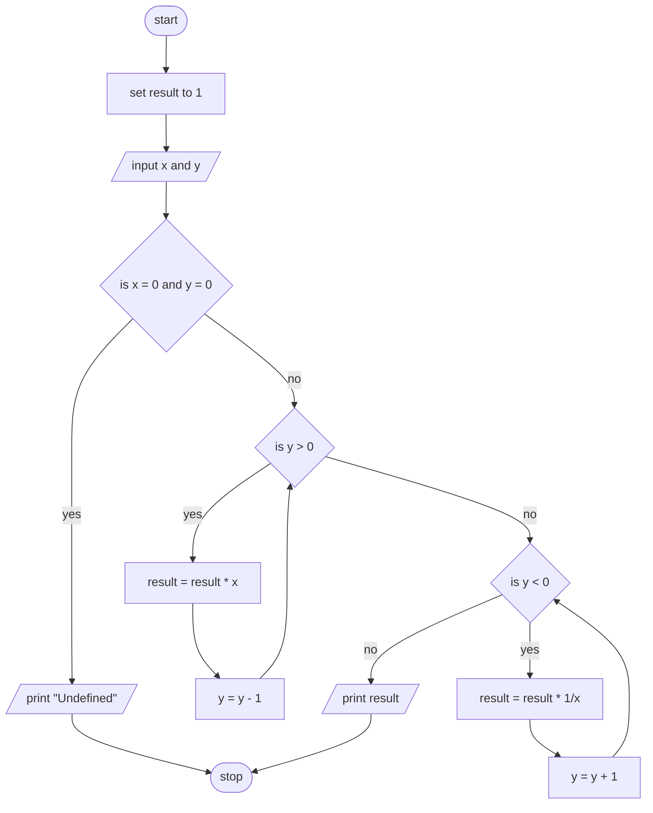

> **Problem Description**: Write a program that find the result of the expression xy where the value of X and Y are entered by the user.

**Problem Analysis**:  
*Input*: x (float), y (int)  
*Output*: result (float)  
*Process*:
- initialize result to 1
- input x and y
- if x = 0 and y = 0 print "Invlaid input" and end the program
- if y > 0 calculate result as result multiplied by x, y times
- if y < 0 calculate result as result multiplied by 1/x, |y| times
- print result

**Flowchart**:

**Pseudocode**:
1. START
2. SET result to 1
3. READ x and y
4. IF x = 0 and y = 0 THEN
5. PRINT "Undefined"
6. STOP
7. ENDIF
8. IF y > 0 THEN
9. WHILE y > 0
10. CALCULATE result as result * x
11. CALCULATE y as y - 1
12. ENDWHILE
13. ELSE IF y < 0 THEN
14. WHILE y < 0
15. CALCULATE result as result * 1/x
16. CALCULATE y as y + 1
17. ENDWHILE
18. ENDIF
19. PRINT result
20. STOP
