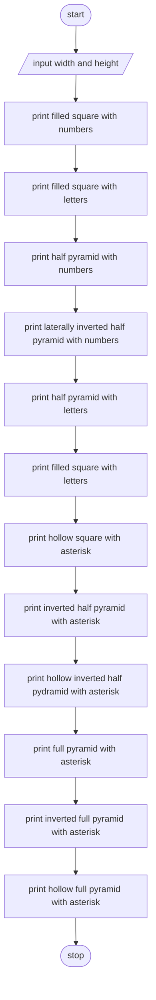

> **Problem Description**:  
> (a) Write a program that generate each of the pattern on the right side. (Images provided with question)  
> (b) Update your program in (a) to allow user to input the dimension of the pattern.

**Problem Analysis**:  
*Input*: width (int), height (int)  
*Output*: pattern  
*Process*:  
- input width and height
- print filled square with numbers
- print filled square with letters
- print half pyramid with numbers
- print laterally inverted half pyramid with numbers
- print half pyramid with letters
- print filled square with letters
- print hollow square with asterisk
- print inverted half pyramid with asterisk
- print hollow inverted half pydramid with asterisk
- print full pyramid with asterisk
- print inverted full pyramid with asterisk
- print hollow full pyramid with asterisk

**Flowchart**:  
*Main Flowchart*:  

