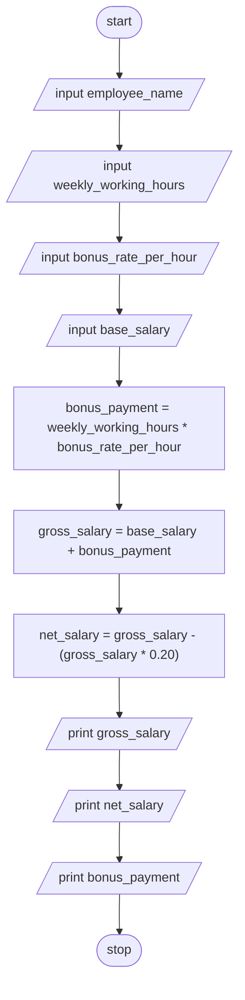

> **Problem Description**: Design an algorithm and write a to read an employee name weekly working hours, bonus rate per hour and
> base salary and find the employees gross-salary, net salary and bonus payment. (Hint: pension rate – 5%, tax: 15%).

**Problem Analysis**:  
*Input*: employee_name (string), weekly_working_hours (float), bonus_rate_per_hour (float), base_salary (float)  
*Output*: gross_salary (float), net_salary (float), bonus_payment (float)  
*Process*:
- input employee_name, weekly_working_hours, bonus_rate_per_hour and base_salary
- calculate bonus_payment as weekly_working_hours * bonus_rate_per_hour
- calculate gross_salary as base_salary + bonus_payment
- calculate net_salary as gross_salary - (gross_salary * (0.05 + 0.15))
- print gross_salary, net_salary and bonus_payment

**Flowchart**:

**Pseudocode**:
1. START
2. READ employee_name, weekly_working_hours, bonus_rate_per_hour and base_salary
3. CALCULATE bonus_payment as weekly_working_hours * bonus_rate_per_hour
4. CALCULATE gross_salary as base_salary + bonus_payment
5. CALCULATE net_salary as gross_salary - (gross_salary * 0.20)
6. PRINT gross_salary, net_salary and bonus_payment
7. STOP
