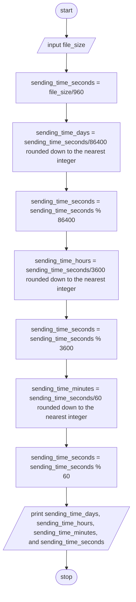

> **Problem Description**: A serial transmission line can transmit 960 characters a second. Write a program that will calculate how long
> it will take to send a file, given the file size. Test your program on a 400MB (419,430,400 byte) file which may take days.

**Problem Analysis**:  
*Input*: file_size in bytes (int)  
*Output*: sending_time in days,hours,minutes,seconds (int)  
*Process*:
- input file_size
- calculate sending_time_seconds as file_size/960
- calculate sending_time_days as sending_time_seconds/86400 rounded down to the nearest integer
- calculate sending_time_seconds as sending_time_seconds % 86400
- calculate sending_time_hours as sending_time_seconds/3600 rounded down to the nearest integer
- calculate sending_time_seconds as sending_time_seconds % 3600
- calculate sending_time_minutes as sending_time_seconds/60 rounded down to the nearest integer
- calculate sending_time_seconds as sending_time_seconds % 60
- print sending_time_days, sending_time_hours, sending_time_minutes, and sending_time_seconds

**Flowchart**:

**Pseudocode**:  
1. START
2. READ file_size
3. CALCULATE sending_time_seconds as file_size/960
4. CALCULATE sending_time_days as sending_time_seconds/86400 rounded down to the nearest integer
5. CALCULATE sending_time_seconds as sending_time_seconds % 86400
6. CALCULATE sending_time_hours as sending_time_seconds/3600 rounded down to the nearest integer
7. CALCULATE sending_time_seconds as sending_time_seconds % 3600
8. CALCULATE sending_time_minutes as sending_time_seconds/60 rounded down to the nearest integer
9. CALCULATE sending_time_seconds as sending_time_seconds % 60
10. PRINT sending_time_days, sending_time_hours, sending_time_minutes, and sending_time_seconds
11. STOP

**Tests**:  
*Test 1*  
input: a file size of 400MB (419,430,400 bytes)  
output: it will take 5 days, 1 hour, 21 minutes, and 46 seconds to send the file
