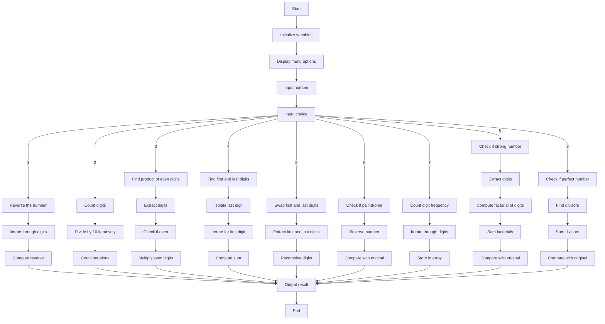

Write a program that accepts an integer from the user and perform the following. Once you complete solving all the exercises compile it and prepare a menu.

a) Prints the reverses of the number (e.g. input = 4637215 Output=5217364).

b) Counts the number of digits in a given number (e.g. 23,498 has five digits)

c) Find the product of even digits of the a given number (e.g. input=4,923 prod=8)

d) Prints the first and the last digit of the number and find their sum.

e) Swap the first and the last digit of the number.

g) Check whether a number is palindrome or not.

h) Find the frequency of each digit in a given integer and print in table format.

i) Check if a number is Strong or not.

[Hint]: A Strong number is a number, where the sum of the factorial of the digits is equal to the

number itself.

j) Check whether a number is Perfect number or not.

[Hint]: A Perfect Number is an integer where the sum of its divisors minus the number itself

equals the number.

## ***FLOW CHART***

