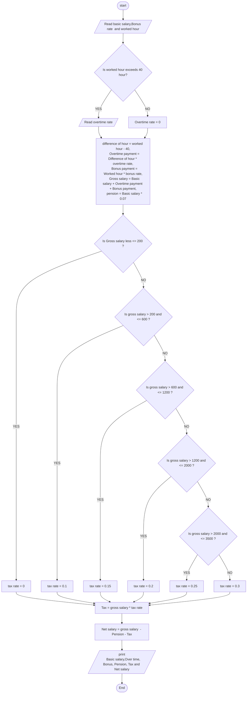

## **Problem description**

Develop a program that find the Net-Pay of an employee after deduction of pension (7%) and tax based on tax rate provided.
The program should read the basic salary, worked hours, and bonus rate. If the employee worked hours exceed 40 hrs., the program
prompts the user to enter an over-time bonus rate/hour.

## **problem analysis**

**Input** = base salary, bonus rate, worked hour, over time rate 

**Output** = base salary, bonus payment, overtime payment, gross salary , pension, tax, net salary

**Process** = calculate 
               > bonus payment = worked hour * bonus rate

               > overtime payment = worked hour * overtime rate

              > gross salary = base salary + bonus payment + over time payment

              > pension = gross salary * 0.07

              > tax = gross salary * tax rate

              > net salary = gross salary - pension - tax
            

## ***FLOW CHART***

