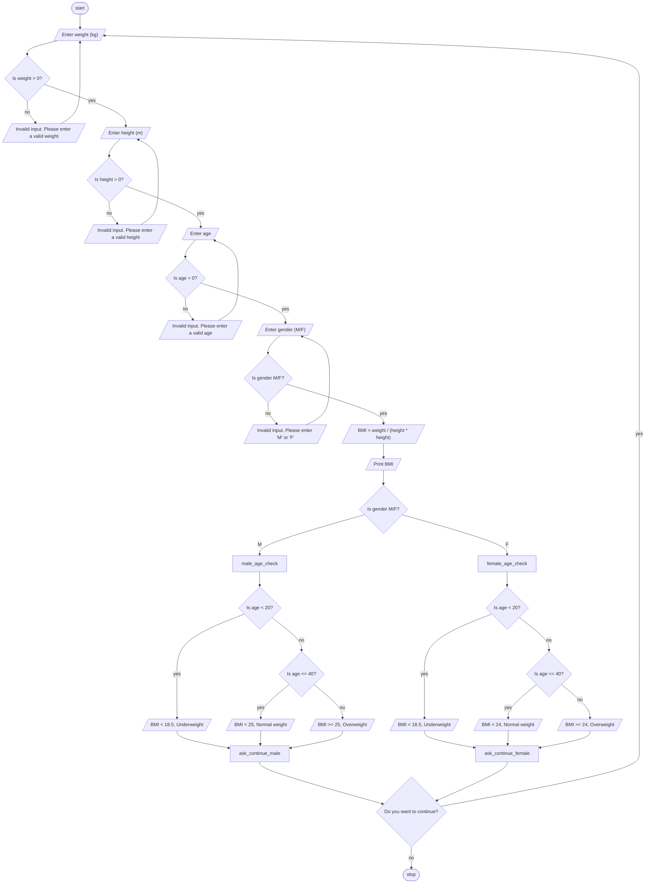

```mermaid
flowchart TD
    start([start]) --> input_weight[/"Enter weight (kg)"/]
    input_weight --> validate_weight{"Is weight > 0?"}
    validate_weight -- no --> invalid_weight[/"Invalid input. Please enter a valid weight"/]
    validate_weight -- yes --> input_height[/"Enter height (m)"/]
    invalid_weight --> input_weight
    input_height --> validate_height{"Is height > 0?"}
    validate_height -- no --> invalid_height[/"Invalid input. Please enter a valid height"/]
    validate_height -- yes --> input_age[/"Enter age"/]
    invalid_height --> input_height
    input_age --> validate_age{"Is age > 0?"}
    validate_age -- no --> invalid_age[/"Invalid input. Please enter a valid age"/]
    validate_age -- yes --> input_gender[/"Enter gender (M/F)"/]
    invalid_age --> input_age
    input_gender --> validate_gender{"Is gender M/F?"}
    validate_gender -- no --> invalid_gender[/"Invalid input. Please enter 'M' or 'F'"/]
    validate_gender -- yes --> process_bmi[/"BMI = weight / (height * height)"/]
    invalid_gender --> input_gender
    process_bmi --> print_bmi[/"Print BMI"/]
    print_bmi --> check_bmi{"Is gender M/F?"}
    check_bmi -- M --> male_age_check
    check_bmi -- F --> female_age_check

    male_age_check --> check_age_male{"Is age < 20?"}
    check_age_male -- yes --> bmi_underweight_male[/"BMI < 18.5, Underweight"/]
    check_age_male -- no --> check_age_male_2{"Is age <= 40?"}
    check_age_male_2 -- yes --> bmi_normal_male[/"BMI < 25, Normal weight"/]
    check_age_male_2 -- no --> bmi_overweight_male[/"BMI >= 25, Overweight"/]
    bmi_underweight_male & bmi_normal_male & bmi_overweight_male --> ask_continue_male

    female_age_check --> check_age_female{"Is age < 20?"}
    check_age_female -- yes --> bmi_underweight_female[/"BMI < 18.5, Underweight"/]
    check_age_female -- no --> check_age_female_2{"Is age <= 40?"}
    check_age_female_2 -- yes --> bmi_normal_female[/"BMI < 24, Normal weight"/]
    check_age_female_2 -- no --> bmi_overweight_female[/"BMI >= 24, Overweight"/]
    bmi_underweight_female & bmi_normal_female & bmi_overweight_female --> ask_continue_female

    ask_continue_male --> ask_continue{"Do you want to continue?"}
    ask_continue_female --> ask_continue
    ask_continue -- yes --> input_weight
    ask_continue -- no --> stop([stop])
```
