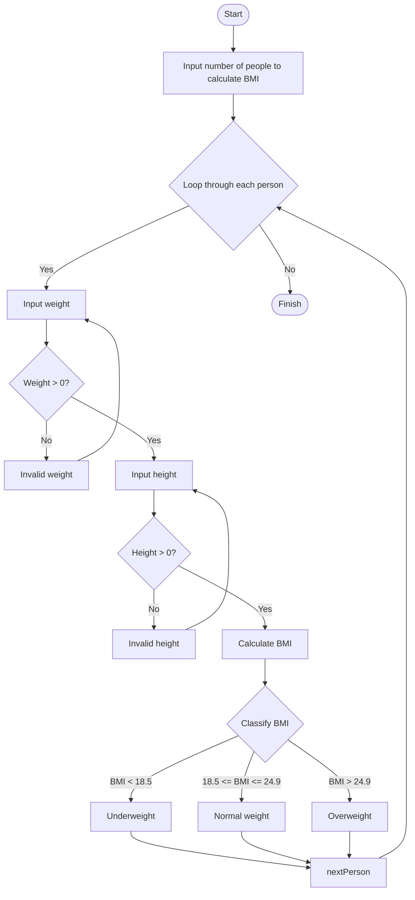

**Problem Description**:  
The program calculates the Body Mass Index (BMI) for multiple people. For each person, the BMI is computed using the formula:  
`BMI = weight / (height * height)`  
The program then categorizes the BMI into three groups: underweight, normal weight, and overweight. It repeats the calculation for the specified number of people.

**Problem Analysis**:  

*Input*:  
- Number of people to calculate BMI for (integer).  
- For each person:
  - Weight in kilograms (float).  
  - Height in meters (float).  

*Output*:  
- BMI (float) for each person.  
- BMI category (underweight, normal weight, or overweight).  

*Process*:  
1. Ask the user for the number of people to calculate BMI for.  
2. For each person:  
   - Prompt the user to input weight and height.  
   - Validate inputs to ensure they are positive.  
   - Calculate BMI using the formula: `BMI = weight / (height * height)`.  
   - Classify the BMI into:
     - Underweight: BMI < 18.5.  
     - Normal weight: BMI between 18.5 and 24.9 (inclusive).  
     - Overweight: BMI >= 25.  
   - Display the BMI and category.  
3. Repeat until BMI is calculated for all people.  

---

**Flowchart**:

**pseudocode**:  

1. Start.  
2. Ask the user for the number of people to calculate BMI for and store it in `numPersons`.  
3. Loop from 1 to `numPersons` for each person:  
   - Print the current person number.  
   - Prompt the user to enter the weight and validate that it is positive.  
   - Prompt the user to enter the height and validate that it is positive.  
   - Calculate BMI as `BMI = weight / (height * height)`.  
   - If BMI < 18.5, categorize as "Underweight".  
   - Else if BMI is between 18.5 and 24.9 (inclusive), categorize as "Normal weight".  
   - Else, categorize as "Overweight".  
   - Display the BMI and the category.  
4. End the loop after all persons have been processed.  
5. Print a message indicating that all BMI calculations are complete.  
6. Stop.  

---
