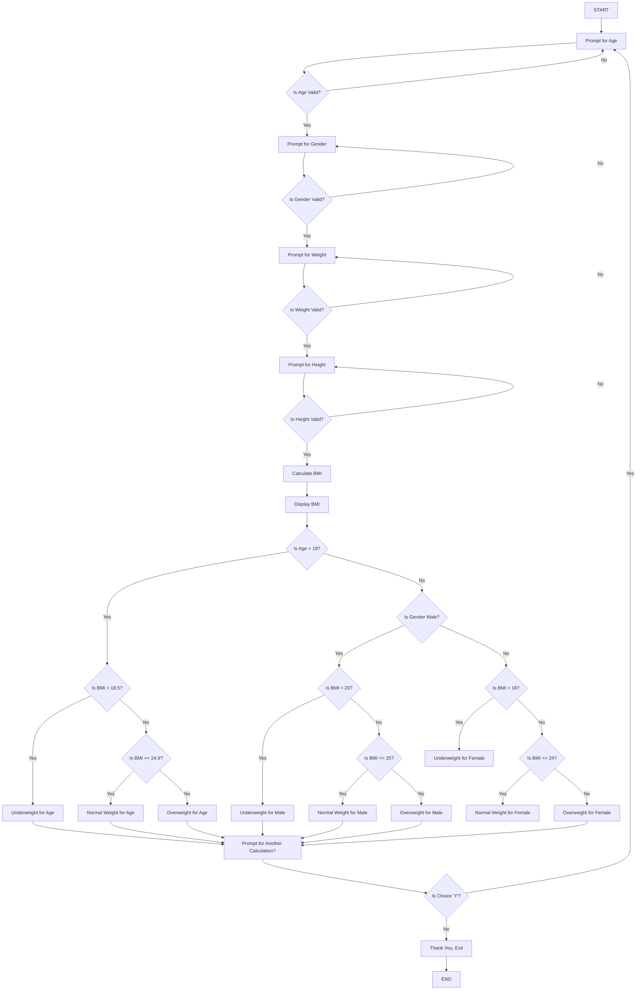

```mermaid
flowchart TD
    A[START] --> B[Prompt for Age]
    B --> C{Is Age Valid?}
    C -->|No| B
    C -->|Yes| D[Prompt for Gender]
    D --> E{Is Gender Valid?}
    E -->|No| D
    E -->|Yes| F[Prompt for Weight]
    F --> G{Is Weight Valid?}
    G -->|No| F
    G -->|Yes| H[Prompt for Height]
    H --> I{Is Height Valid?}
    I -->|No| H
    I -->|Yes| J[Calculate BMI]
    J --> K[Display BMI]
    K --> L{Is Age < 18?}
    L -->|Yes| M{Is BMI < 18.5?}
    M -->|Yes| N[Underweight for Age]
    M -->|No| O{Is BMI <= 24.9?}
    O -->|Yes| P[Normal Weight for Age]
    O -->|No| Q[Overweight for Age]
    L -->|No| R{Is Gender Male?}
    R -->|Yes| S{Is BMI < 20?}
    S -->|Yes| T[Underweight for Male]
    S -->|No| U{Is BMI <= 25?}
    U -->|Yes| V[Normal Weight for Male]
    U -->|No| W[Overweight for Male]
    R -->|No| X{Is BMI < 18?}
    X -->|Yes| Y[Underweight for Female]
    X -->|No| Z{Is BMI <= 24?}
    Z -->|Yes| AA[Normal Weight for Female]
    Z -->|No| AB[Overweight for Female]
    AB --> AC[Prompt for Another Calculation?]
    W --> AC
    V --> AC
    T --> AC
    Q --> AC
    P --> AC
    N --> AC
    AC --> AD{Is Choice 'Y'?}
    AD -->|Yes| B
    AD -->|No| AE[Thank You, Exit]
    AE --> AF[END]
```
