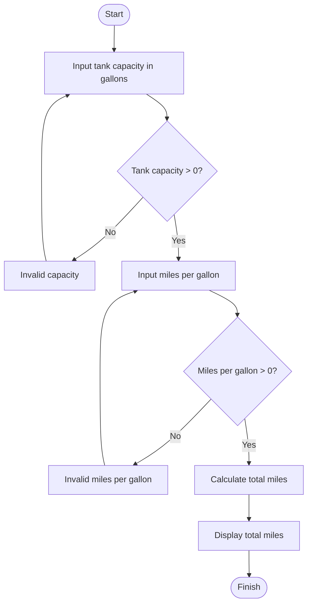

**Problem Description**:  
The program calculates how many miles a car can travel without refueling based on the fuel tank capacity and miles per gallon (MPG). The user is prompted to enter the fuel tank capacity and the number of miles the car can drive per gallon. The program then calculates and outputs the total number of miles the car can drive without needing to refuel.

**Problem Analysis**:  

*Input*:  
- Tank capacity in gallons (positive float).  
- Miles the car can drive per gallon (positive float).  

*Output*:  
- Total miles the car can travel without refueling (float).  

*Process*:  
1. The user is prompted to input the tank capacity in gallons.
2. The program checks if the input is valid (positive number). If the input is invalid, the user is prompted again.
3. The user is prompted to input the number of miles the car can drive per gallon.
4. The program checks if the input is valid (positive number). If the input is invalid, the user is prompted again.
5. The program calculates the total miles the car can travel by multiplying the tank capacity by miles per gallon.
6. The program displays the total miles the car can travel before needing to refuel.

---
**Flowchart**:  

*pseudocode**:  

1. Start.  
2. Declare variables: `tankCapacity`, `milesPerGallon`, and `totalMiles`.  
3. Loop:  
   - Ask the user for the tank capacity.  
   - If the input is invalid (<= 0), print an error message and prompt again.  
   - Exit the loop once a valid input is entered.  
4. Loop:  
   - Ask the user for the miles per gallon.  
   - If the input is invalid (<= 0), print an error message and prompt again.  
   - Exit the loop once a valid input is entered.  
5. Calculate the total miles: `totalMiles = tankCapacity * milesPerGallon`.  
6. Display the total miles the automobile can drive.  
7. Stop.

---

