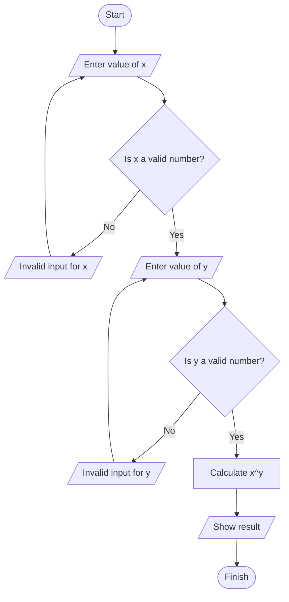

**Problem Description**:  
This program calculates the result of raising a number `x` to the power of `y` (i.e., \( x^y \)) using the `pow()` function from the `cmath` library. It prompts the user for two inputs: `x` and `y`, and checks if the inputs are valid numbers. If any input is invalid, it asks the user to re-enter the value until valid inputs are provided. Once valid inputs are received, the program calculates and displays the result.

**Problem Analysis**:  

*Input*:  
- `x` (a number to be raised to a power, float or double).  
- `y` (the exponent, float or double).  

*Output*:  
- The result of raising `x` to the power of `y` (float or double).  

*Process*:  
1. The user is prompted to enter the value of `x`.
2. If the input for `x` is invalid (not a number), an error message is shown, and the user is prompted to enter a valid number.
3. The user is prompted to enter the value of `y`.
4. If the input for `y` is invalid (not a number), an error message is shown, and the user is prompted to enter a valid number.
5. Once both inputs are valid, the program calculates the result of \( x^y \) using the `pow()` function.
6. The result is displayed to the user.
7. The program stops once valid inputs have been provided and the result is displayed.

---
**Flowchart**:  

**pseudocode**:  

1. Start.  
2. Declare variables: `x`, `y`, `result`, and `validInput` (set to false initially).  
3. Loop (until valid inputs are received):  
   - Ask the user for the value of `x`.  
   - If `x` is invalid (not a number), show an error message and prompt again.  
   - Ask the user for the value of `y`.  
   - If `y` is invalid (not a number), show an error message and prompt again.  
   - If both inputs are valid, calculate `result = pow(x, y)`.  
   - Display the result: "The result of `x` raised to the power of `y` is: `result`".  
4. Stop.

---

