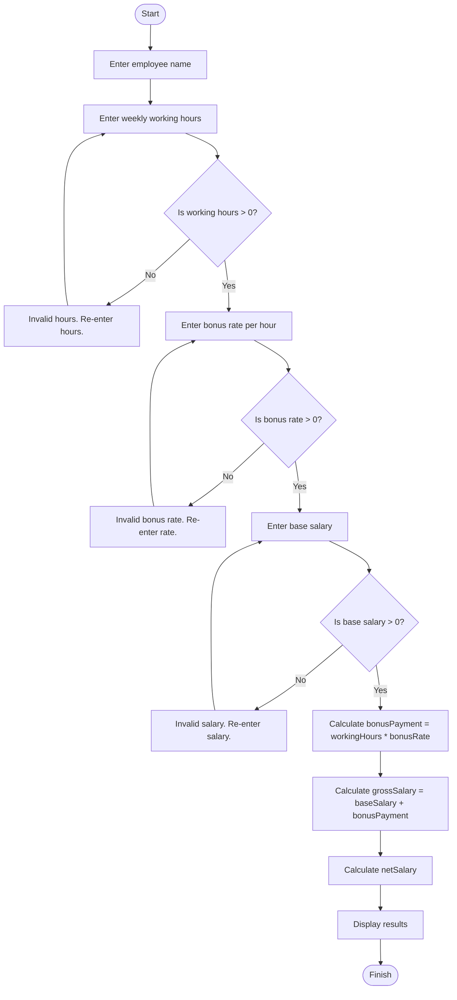

**Problem Description**:  
This program calculates the salary details of an employee. It asks for the employee's name, weekly working hours, bonus rate per hour, and base salary. The program then calculates the bonus payment, gross salary, and net salary. The net salary is determined after subtracting a pension (5%) and tax (15%) from the gross salary. The program ensures that all inputs are positive numbers, prompting the user to re-enter values if any input is invalid.

**Problem Analysis**:  

*Input*:  
- `employeeName` (string)  
- `workingHours` (double): Number of hours worked in a week  
- `bonusRate` (double): Bonus rate per hour  
- `baseSalary` (double): Employee's base salary  

*Output*:  
- `employeeName` (string)  
- `baseSalary` (double)  
- `bonusPayment` (double)  
- `grossSalary` (double)  
- `netSalary` (double): After subtracting 5% pension and 15% tax  

*Process*:  
1. The user is prompted to enter the employee's name, weekly working hours, bonus rate, and base salary.
2. The program checks if the inputs are positive values, and if not, it asks the user to re-enter the values.
3. The bonus payment is calculated by multiplying working hours with the bonus rate.
4. The gross salary is calculated by adding the base salary and the bonus payment.
5. The net salary is calculated by subtracting 5% for pension and 15% for tax from the gross salary.
6. The employee's details and salary breakdown are displayed.

---

  **Flowchart**:  

**pseudocode**:  

1. Start.  
2. Declare variables: `employeeName`, `baseSalary`, `bonusRate`, `workingHours`, `grossSalary`, `netSalary`, `bonusPayment`.  
3. Prompt user to input `employeeName`, `workingHours`, `bonusRate`, and `baseSalary`.  
4. Validate inputs:
   - If `workingHours`, `bonusRate`, or `baseSalary` is negative, prompt the user to re-enter the values until they are positive.
5. Calculate:
   - `bonusPayment = workingHours * bonusRate`
   - `grossSalary = baseSalary + bonusPayment`
   - `netSalary = grossSalary - (grossSalary * 0.05) - (grossSalary * 0.15)`
6. Output the employee's name, base salary, bonus payment, gross salary, and net salary.  
7. Stop.

---

