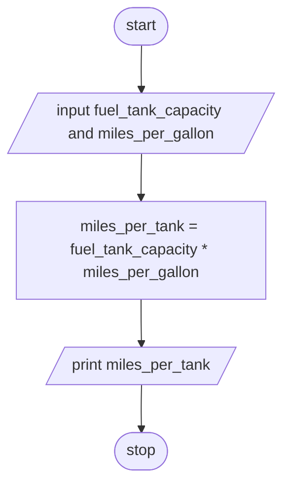

# Problem Statement: 
Design an algorithm and write a to read an employee name weekly working hours, bonus rate per hour and base salary and find the employees gross-salary, net salary and bonus payment. (Hint: pension rate – 5%, tax: 15%).

##  A) Problem Analysis:
###  1. Inputs:
- Employee name.
- Weekly working hours.
- Bonus rate per hour.
- Base salary.
  
### 3. Process:
 * prompting and accepting inputs.
* Bonus Payment:
  * Bonus_Payment=Weekly_Working_Hours*Bonus_Rate_per_Hour
* Gross Salary:
  * Gross_Salary =Base_Salary +Bonus_Payment
* Pension Deduction (5% of Gross Salary):
  * Pension=0.05×Gross_Salary 
* Tax Deduction (15% of Gross Salary):
  * Tax=0.15×Gross_Salary
* Net Salary:
  * Net Salary=Gross_Salary−(Pension+Tax)
* displaying prompt messages and uotputs.

### B)  pseudocode
1. START
2. READ fuel_tank_capacity and miles_per_gallon
3. CALCULATE miles_per_tank as fuel_tank_capacity * miles_per_gallon
4. PRINT miles_per_tank
5. STOP

## C) flow chart

